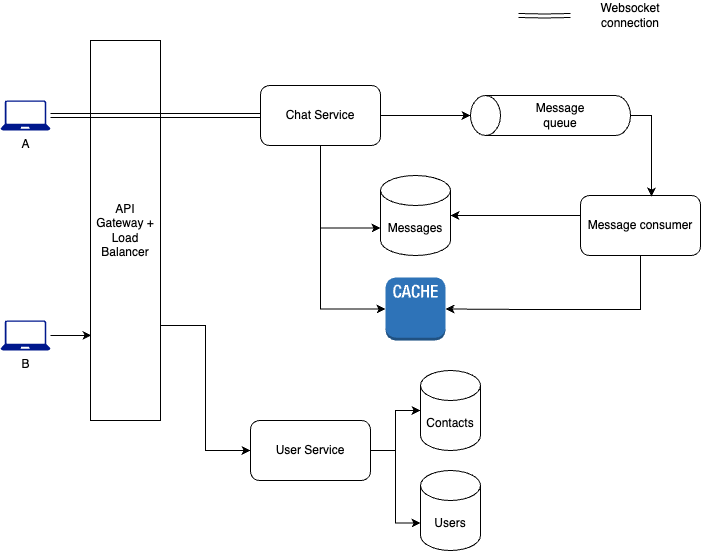

# Chat App
Design a chat app like Whatsapp

## Functional Requirements
- A user can send and receive text messages in real-time
- When the user gets online, they receive all the messages addressed to them during their offline time. Till then, messages are persisted in at server-side.
- Once a message is delivered, it will be stored in the user's device and no longer needs to be stored on the server.
- User shouldn't see duplicate messages.
- The system should support group chats.
- Users should be able to see their contacts' online status.

## Non-functional Requirements
- System should be highly available.
- Data must be persistent when we respond that write is successful.

## Resource estimation

### Requirements
- 100M DAU
- 20 average daily messages per user
- The maximum length of a message is 1000 English characters
- Store the undelivered chats for 1 year

Given 100M DAU and 20 messages/user, `number of messages sent/received per day = 100M x 20 = 2000M = 2B` <br>
which means, `send/receive QPS = 2B / (24 x 60 x 60) = ~23K req/s` <br>
For peak hours, `considering 10x traffic, send/receive QPS = 230K`

As each message is of max 1000 English characters, `max size of each message = 1000 x 1 byte = 1KB` <br>
This translates to `amount of data sent/received per day = 1KB x 2B = 2TB` <br>
`Bandwidth needed for handling send/receive = 2TB/(24 x 60 x 60) = ~23MBps`

Considering 30% of all messages need to be stored on the server for users who are not online at the moment, (i.e., considering all users will come online in 4 months on average), `amount of data to be stored = data produced per day x 4 months = 4 x 30 x (100M x 20 x 200B) = ~48TB`

## API Design

### Chat Service
Since, we need to store and track messages sent by each user, we don't want direct user-to-user communications. All communications will go through a Chat Service. So, for each connection between 2 users A and B, there will be 2 connections: `A <-> Server` and `Server <-> B`. Communication between client application and system servers will be via WebSockets. A traditional client-server communication won't work in this case because either party may send messages at any time.
> Workflow for creating a WebSocket connection between a user and server is explained in High-level design section.

#### URL
```
wss://chatserver.example.com/
```
#### Request example
```
GET /connect HTTP/1.1
Host: chatserver.example.com
Upgrade: websocket
Connection: Upgrade
Authorization: Bearer <JWT_TOKEN>
Sec-WebSocket-Key: <random-key>
Sec-WebSocket-Version: 13
```
#### Server response
```
HTTP/1.1 101 Switching Protocols
Upgrade: websocket
Connection: Upgrade
Sec-WebSocket-Accept: <hashed-key>
```

## Data Storage

`Messages` table will have high read and write load. A particular record will be read in its entirety and there won't be any complex joins. So, a NoSQL database (MongoDB, DynamoDB etc.) would be a good choice.
Schema:
```
message_id (UUID, primary key)
sender_id (UUID)
receiver_id (UUID)
timestamp (datetime)
content (string)
status (enum) (sent | received | read)
```

`Users` table will be highly structured. Reads and writes on this table would be quite low compared to `Messages`. An RDBMS (MySQL, PostgreSQL etc.) should suffice.
Schema:
```
user_id (UUID, primary key)
contact_number (string)
created_at (datetime)
name (string)
email (string)
profile_pic (URL)
```

We need a `Contacts` table to store the contacts of each user. This can be a RDBMS table to facilitate complex queries and joins.
Schema:
```
user_id (UUID, primary key)
contact_id (UUID, user_id of the person in contact)
created_at (datetime)
```

## High-level design


As per the functional requirements of this problem, we have 2 microservices - Chat Service and User Service. Chat Service is responsible for handling all message requests whereas User Service handles user profiles and their contacts. We can create another service Settings to handle all user settings, or they can be handled by the User Service itself if they're not too complicated.

An API Gateway + Load Balancer sits between client applications and the microservices. It handles authentication, request routing and load balancing.

Chat service pushes all requests to a Message Queue so that they can be handled asynchronously at times of high traffic. There will be multiple instances of message consumers which will process all incoming messages. Processed messages will be stored in `Messages` table and Cache if the recipients are not online. More details about the lifecycle of a message is described below.

### How websocket connection is established?
When User A comes online, they will establish a WebSocket connection with the chat server. This involves the following steps:

#### 1. Establish WebSocket Connection
The client app (e.g., WhatsApp-like mobile or web app) will initiate a handshake to the server using an HTTP-based WebSocket connection upgrade request.

#### 2. Handshake Process
- The server listens for WebSocket connection requests on a specific API endpoint.
- User A sends a connection request, including authentication information such as a JWT token or a session token.
- The server validates the token to ensure User A is authorized to connect.
- If the validation succeeds, the server upgrades the HTTP connection to a WebSocket connection.

#### 3. WebSocket Connection Lifecycle
Once established, the WebSocket connection will remain open for real-time, full-duplex communication.

### Client A sends a message
1. Client A composes the message in the chat interface.
```JSON
{
  "sender_id": "string",
  "receiver_id": "string",
  "content": "string",
  "timestamp": "datetime",
  "client_message_id": "UUID"
}
```
`client_message_id` is needed to prevent sending duplicate messages to the server. More details are present in `Failure Scenarios` section.
2. Client A sends the message to the chat server over its established WebSocket connection.
3. The server validates the message (e.g., checks format, ensures recipient ID exists) and acknowledges receipt of the message to Client A along with a globally unique ID generated by the system.
```JSON
{
  "status": "sent",
  "timestamp": "datetime",
  "client_message_id": "UUID",
  "server_message_id": "UUID"
}
```

### Deliver message to client B when its online
1. The server checks if Client B is connected to the server (maintains an active WebSocket connection). If yes, it retrieves the WebSocket session associated with Client B.
2. The server forwards the message to Client B in real-time over the WebSocket connection.
```JSON
{
  "sender_id": "string",
  "content": "string",
  "timestamp": "datetime",
  "server_message_id": "UUID"
}
```
3. A delivery status update is sent to Client A.
```JSON
{
  "status": "delivered",
  "timestamp": "datetime",
  "server_message_id": "UUID"
}
```
4. If Client B reads the message, it sends a read receipt back to the server. The server forwards the read receipt to Client A.
```JSON
{
  "status": "read",
  "timestamp": "datetime",
  "server_message_id": "UUID"
}
```

### Deliver message to client B when its offline
1. If Client B is not online (no active WebSocket connection), the server stores the message in a persistent database. Message is also stored in the cache for faster delivery when Client B reconnects.
2. When Client B reconnects, server retrieves all undelivered messages for Client B from the database or cache. It sends the messages to Client B in the order of their timestamps.
3. `Delivered` and `Read` receipts are sent to Client A accordingly.

### Failure scenarios
1. If Client A disconnects before the server acknowledges the message, the client retries sending the message upon reconnection. If message has already been received by server, server will detect a duplicate `client_message_id`. It will not take any action on this message but simply send a `Sent` status to Client A. Meanwhile, if the original message is already delivered to/read by Client B, appropriate status updates will be sent to Client A.
2. If the server cannot deliver the message to Client B (e.g., due to transient errors), it retries delivery periodically for a fixed number of times before sending a `Failed` status update to Client A.
3. If server crashes, a new instance will come up and recover messages from database. Client applications will have logic to re-establish WebSocket connections with the server.

## Bottlenecks and scaling
### Caching
Unsent messages are stored in the cache so that users can retrieve them quickly without having to query the database. Once the message is read, it will be removed from cache. Also, we can use an LRU eviction policy, meaning, when the cache reaches its capacity, we remove the messages with the oldest timestamps.

### Database sharing and replication
`Messages` table will have to store a large amount of data as it is expected that many of the users won't be online to receive messages instantaneously. To handle the large amount of data, it needs to be partitioned.

Messages can be partitioned by `user_id`, `message_id` or `timestamp`. Partitioning by `user_id` is more beneficial than the rest as whenever the user comes online, all of their messages can be fetched from a single shard of the DB.

Moreover, all the DB tables can be replicated across Availability Zones to ensure high durability. Replication architecture (single write master with read replicas, multi-master model etc.) can be discussed separately.

## Security
Nowadays, chat systems like Whatsapp provide end-to-end encryption (E2EE) preventing anyone in between (even the chat service itself) from decrypting the messages. This can be achieved using public-private cryptography.
### Example flow
1. When a new user A registers to the chat service, it generates a pair of public-private keys. The public key is stored in the system servers and the private key is stored in the client application only. Public key is used to encrypt messages which can only be decrypted by the private key.
2. When user B wants to send a message to user A, it first fetches the public key of User A from the server. The key can be cached in user B's device to reduce latency for subsequent messages.
3. User A encrypts the message using the public key and sends it to user B.
4. User B uses its private key to decrypt the message.
5. User B can periodically rotate it keys and update to the server. In such a case, user A sends the public key along with the message to the server. If the server sees that the key is stale and sends the fresh key to user A which is then used to encrypt the message again.

## Follow-up questions
1. How to support chat groups?
2. How to support displaying the online/offline status of users?
