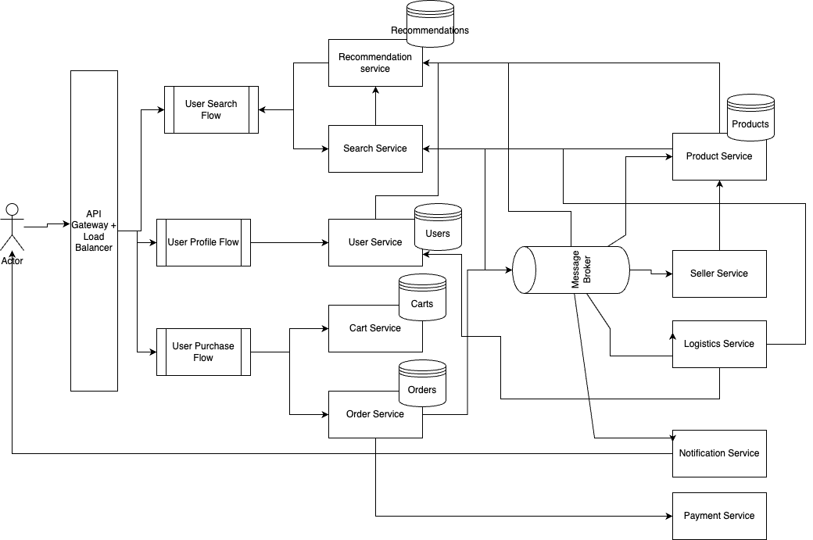

# E-Commerce Store
Design an E-commerce store like Amazon

## Functional Requirements
- **Product Catalog**: The service should have a product catalog where sellers can list their products and buyers can browse or search for products.
- **Inventory Management**: The service should keep track of the inventory for each product. It should update the inventory as products are sold and possibly alert the seller when the inventory is low.
- **Shopping Cart**: Users should be able to add items to a shopping cart and checkout when ready.
- **Order Management**: Users should be able to view their order history, track their orders, and request returns or refunds.

## Non-functional Requirements
- The system should be highly available: The website/app should almost always be up, users should be able to view product catalog, their profile, cart etc. most of the time.
- The system should be consistent and reliable: Products added to the cart should be consistent across all devices.
- Data should be persistent: User activity like product addition to cart should be persisted.

## Resource estimation

### Requirements
- 10M Daily Active Users
- Read:write ratio = 100: 1 
- Data retention for 5 years 
- Assuming 1 million write requests per day 
- Assuming each entry is about 1KB

Given 1M write requests per day and 100:1 read:write ratio, `read requests per day = 100M`. <br>
For 1M writes per day, `write QPS = 1M / (24 x 60 x60) = ~11.57 writes/sec` <br>
As reads are 100x that of writes, `read QPS = 1157 reads/sec`

`Bandwidth required for write requests = 11.57 writes/sec x 1KB = 11.57 KBps` <br>
`Bandwidth required for read requests = 1157 reads/sec x 1KB = 1157 KBps = 1.16MBps`

Total amount of data written per day = `number of write requests per day x size of each entry = 1M x 1KB = 1GB` <br>
Total amount of data read per day = `number of read requests per day x size of each entry = 100M x 1KB = 100GB`

Given, data has to be retained for 5 years, `amount of data to be stored = amount of data written per day x number of days in a year x 5 = 1GB x 365 x 5 = 1825GB = 1.8TB` <br>
This is a manageable amount of data for 5 years as much of the data would be cold and can be archived.

## API Design
There will a number of APIs for different functionalities of the service. Here I have mentioned some common APIs only.

### APIs for Product Catalog

#### User-facing API to view products
```
GET /api/v1/products?offset={page_offset}
OR
GET /api/v1/products?category={product_category}
```
Response:
```JSON
{
  "offset": "value",
  "products": [
    {
        "id": "id1",
        "name": "name",
        "price": "price"
    },
    {
        "id": "id2",
        "name": "name",
        "price": "price"
    }
  ]
}
```

#### Seller-facing API to add product
```
POST /api/v1/products
```
Body:
```JSON
{
  "name": "name",
  "price": "price"
}
```

#### Seller-facing API to update product
```
PUT /api/v1/products/{product_id}
```
Body:
```JSON
{
  "price": "price",
  "quantity": 100
}
```

### APIs for Cart management

#### User-facing API for adding product to cart
```
POST /api/v1/cart/{product_id}
```
Body:
```JSON
{
  "quantity": 2,
  "otherDetails": {
    "size": "size",
    "color": "color"
  }
}
```

#### User-facing API for getting all items in cart
```
GET /api/v1/cart
```
Response:
```JSON
{
  "products": [
    {
        "id": "id1",
        "name": "name",
        "quantity": "quantity"
    },
    {
        "id": "id2",
        "name": "name",
        "quantity": "quantity"
    }
  ]
}
```

### APIs for Orders management

#### User-facing API for getting order history
```
GET /api/v1/orders?startDate={date}&endDate={date}
```
Response:
```JSON
{
  "orders": [
    {
        "id": "id1",
        "details": {}
    }
  ]
}
```

#### User-facing API for tracking order
```
GET /api/v1/track/{order_id}
```
Response:
```JSON
{
  "id": "id",
  "ETA": "date",
  "products": {}
}
```

#### User-facing API for cancelling item
```
POST /api/v1/cancel
```
Body:
```JSON
{
    "order": "order_id",
    "product": "product_id",
    "reason": "reason",
    "refundInstructions": {}
}
```

## Data Storage
For a complex system like e-commerce, there is no one-size-fits-all database. Schemas will vary greatly, some of which will be structured while others will be unstructured. Hence, different types of DBMS will handle data for different requirements. E.g., Users and Orders data is structured, so it can be handled by a structural DB. Whereas, Product data will be unstructured as different products have different specifications/features, so a non-structural DB would be a good fit. Again, inventory management data needs strong ACID properties, so a SQL DB would be suitable.

We won't go into the details of each table and its schema as it can be quite a large number. Required tables for each microservice will be discussed in the high-level design.

## High-level design


E-commerce is a complex system and would comprise a number of microservices. It would be difficult to discuss each service in-depth, so we are considering the major services in-line with the functional requirements listed here.

From a user perspective, we divide the system into 3 flows. Users will be able to perform different actions under these 3 categories. All the APIs for these flows are sitting behind an API Gateway/Load balancer.

### User Search Flow
The 2 user-facing services that come under this flow are Recommendation service and Search service. Recommendation service is responsible for creating the landing page of the app/website tailored to different users. It will interact with Product service (to fetch information about which products are available) and User service (to fetch user metadata) and build a recommended catalog for each user. On the other hand, Search service is responsible for showing different products when user types certain keywords. It will also interact with Recommendation service and Product service to build a search list tailored to a particular user while respecting the keywords provided in input.

Search service will have its ElasticSearch database to provide text search functionalities. (TODO: DB for recommendation service). Both of these services will subscribe to a message broker to which all order events are published. Based on order history of users, these services will update their recommendations.

### User Profile Flow
The service handling User Profile flow is the User service. This service will handle all user profiles and related CRUD operations. It will provide necessary user data to Recommendation service and Logistics service for their functionality.

As user data is very structured, User service can make use of SQL database like MySQL. Data can be stored in a normalised way which will make read queries faster for dependent services. Users can be sharded by geography as users are mostly going to purchase items within their own region.

### User Purchase Flow
This flow consists of 2 services - Cart service and Order service. Cart service manages the cart of each user. Carts should be highly consistent so that they are readily available across multiple devices of same user. So, a SQL database with ACID properties would be helpful. Also, carts data can be easily sharded by user to help store huge amounts of data efficiently.

Order service is a complicated service as each order gives rise to a chain of events. When an order is placed, payment service is first contacted to generate a payment request. Once the payment is completed, an event is generated and published to a message broker. Multiple services subscribe to it.
- Seller service consumes this event to inform the seller of a new sale.
- Logistics service consumes this event to keep track of the order and arrange necessary delivery services.
- Notification service sends notifications (email, app notification etc.) to the user based on this event.
- Recommendation service consumes this event to recalibrate its recommendation for that user.
- Product service updates its inventory accordingly.

#### How to handle race conditions while placing orders?
If a single item of a product P is available, we don't want 2 users to be able to order it simultaneously. Hence, it is obvious that Order service needs to use a database having ACID properties. So, when a user places an order for product P, an order record is created with an expiration time (say 5 minutes). Product service updates inventory to show that P is out-of-stock. Simultaneously, a payment request is made to the Payment service. Payment service ensure that payment is completed before order expiration time. If not completed, it informs Product service to increase count of P, and also informs Order service to mark the order as Cancelled. If inventory is not updated before payment procedure begins, it is possible that multiple users will pay for the same item and all requests but 1 have to be cancelled and payment refunded. It will be a bad user experience.

### Other backend services
There are some backend services which users do not interact with directly:
- Product service: It is responsible for handling inventory of all products. Seller service communicates with it to add/update/delete products. It will have a NoSQL database as product data is unstructured.
- Seller service: It holds all sellers' information. 
- Logistics service: It is responsible for handling all deliveries.
- Notification service: Handles all kinds of notifications sent to users.
- Payment service: It handles all payments. It further connects to payment gateways.
- Message broker: This handles all events published by order service when new orders are placed or existing ones are modified/cancelled. Other services consumes events from it and perform necessary actions.

## Bottlenecks and scaling
An e-commerce system experiences huge read traffic in general and often huge write traffic as well (especially during sale and festive seasons). It is important to identify bottlenecks in the system and optimize them for better performance.

### Load Balancing
A single server won't be able to handle all the traffic. Servers can be divided to handle different microservices. This will help us scale each service independently. Even for a single service, servers may need to be scaled out. In that case, load balancers have to be placed between users and the servers to ensure proper distribution of load.

### Caching
Caching can be implemented in different microservices to improve performance.

#### Search and Recommendation service
These services experience high read traffic in general. Database queries for these services are usually complex and slow. Cache system like Redis or Memcached can be used to store frequently accessed product details. Popular search results can be cached to improve response times. It should be an expiration-based cache to evict stale data as regular intervals. Also, cache should be invalidated when recommendations are updated.

#### Product service
Inventory details need to be updated in real-time whenever orders are placed/cancelled or sellers update it. This creates large read and write traffic and becomes a bottleneck. Popular product details can be cached to avoid heavy load on the database. The cache has to be write-through or write-behind to ensure consistency with the database. Also, the cache has to have a short TTL to double-down on consistency.

#### Cart service
Cart service experiences large write traffic during sale or festive seasons. A session-based cache can be implemented to handle such traffic. Data from the cache will be periodically updated to the DB as well as when the session ends (user closes the app/webpage on a device). A standard LRU cache can be implemented to evict data of carts inactive carts efficiently.

Apart from the above, CDN can be set up to serve static content like product images/videos, stylesheets and JS. Also, rate-limiting can be implemented to prevent overloading of services, especially when using external APIs for order processing or payment gateways.

Finally, caching strategies have to monitored continuously to ensure their effectiveness. Cache configurations might be optimized based on usage patterns observed from monitoring data.

### Partitioning
As the amount of data is huge, a single DB instance cannot handle all the load. We can partition different tables and store them in separate DB shards.

Search and Product data can be partition by Product type so that when a user queries for a particular keyword, request can be to specific shard for that product. Similarly, User, Order and Cart data can be partitioned by UserId to achieve homogeneously distributed traffic.
