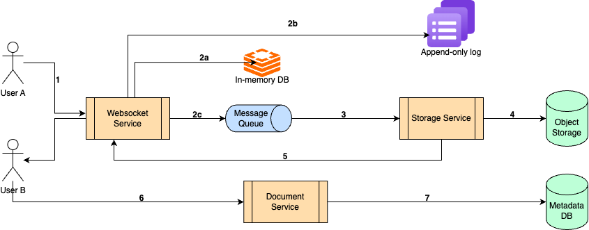

# Google Docs
Design a collaborative editing application like Google Docs.

## Functional Requirements
- User should be able to create a new doc and obtain a shareable link.
- Multiple users should be able to view and edit the doc simultaneously. System should resolve conflicts automatically.
- Updates should be visible to all users in real-time.
- All changes made to the doc should be trackable i.e., user should be able to view previous version of the doc.
- Rich text support: Support for headings, bullet points, tables, images, etc.

## Non-functional Requirements
- System should be scalable to millions of users.
- System should be highly available.
- System should have ultra-low latency. Collaborators should be able to see updates in near real-time.
- Each document state should be consistent across all collaborators (eventual consistency but with ultra-low latency)
- System should be durable i.e., all documents should be stored in the system.
- Data should be secure. It should be encrypted at rest and in transit.

## Resource estimation

### Requirements
- 1M Daily Active Users
- Read:write ratio = 10:1
- Average document size = 100KB
- 1 edit per second per document during peak hours

Assuming each user performs 10 reads every day, for 1M DAU, we have `10M reads and 1M writes everyday`.

Out of the writes, considering 1% of them are creation of new documents, `number of documents created everyday = 10% of 1M = 0.01 x 1M = 10K`

Again since average document size is 100KB, `amount of additional content produced per day = 100K x 100KB = 10GB`. <br> `Amount of storage needed for 5 years = 10GB x 365 x 5 = 18.25TB`. Also, we can cap the amount of storage per user, say `15GB`.

## API Design

- `POST /api/document` - Create new doc
    <br> Response:
    ```json
    {
      "document_id": "{{String}}",
      "created_at": "{{datetime}}"
    }
    ```
  
- `GET /api/document/{document_id}` - Get doc by ID
  <br> Response:
    > Considering content is in the form of a hierarchy represented by JSON
  ```json
  {
    "document_id": "{{String}}",
    "created_at": "{{datetime}}",
    "created_by": "{{user_id}}",
    "content": {}
  }
  ```
  
- `GET /api/document/link/{document_id}?type={VIEWER | COMMENTER | EDITOR}` - Get shareable link
  <br> Response:
    ```json
    {
      "link": "{{url}}"
    }
    ```

- `DELETE /api/document/{document_id}` - Delete a document
<br> Response:
  ```json
  {
    "status": "SUCCESSFUL | FAILED",
    "error_message": "{{string}}"
  }
  ```
  
Apart from the above APIs, when a new doc is created or fetched (using first 2 APIs mentioned above), a WebSocket connection is created between client and the service to handle edit requests.
Sample WebSocket messages:
> `operations` is an array so that we can batch some operations together and send a single request and reduce network traffic wherever applicable.
> 
Sample:
```json
{
  "user_id": "{{String}}",
  "operations": [
    {
      "type": "INSERT",
      "position": "{{Integer}}",
      "content": {}
    },
    {
      "type": "DELETE",
      "position": "{{Integer}}",
      "length": "{{Integer}}"
    }
  ]
}
```

## Data Storage
Metadata tables such as `Users`, `DocumentDetails` etc., will have structured data. These tables need ACID properties so a RDBMS would be suitable.

Document content is unstructured data with large size. Ideal way to store such data is Object Storage such as `Amazon S3`, `Azure Blob Storage` etc. These storage solutions support high read traffic, versioning, and cheap, scalable and durable.

Now the issue is that object storage doesn't support partial updates to files. If any change needs to be made to a file, the entire file has to be re-uploaded. So we don't want to write every edit to storage separately. Updates should be batched and periodically synced.
This is how it will work:
1. Very frequent updates are stored in in-memory low-latency DBs such as `Redis`. Only the diff will be stored. Active users will have web socket connections to the service to reduce latency further.
2. Each of the writes will be persisted in an append-only log for durability. In case the in-memory DB goes down, the document state can be built from the log. Each edit is appended like:
    ```json
    { "doc_id": 123, "op": "insert", "pos": 10, "text": "xyz", "timestamp": 1689890000 }
    ```
3. Periodically (after each x minutes or each y writes), generate a snapshot of the current document state and upload it to storage. If versioning functionality is needed, do not delete previous version of the document in storage.
4. Whenever the document is loaded or refreshed, fetch latest version from storage and apply recent edits from in-memory DB or log.

Also, we have to store a mapping for `document_id` and `storage_url`. This can be stored in a key-value store such as `Cassandra`.

## High-level Design
The system consists for 3 microservices.
1. **Websocket Service**: Manages real-time connections. Routes edit operations (CRDTs / OT) between clients of the same document . Broadcasts edits to other users editing the same doc. Forwards edits to In-memory DB, Append-only Log and Message Queue.
2. **Storage Service**: Handles the core functionality of applying diffs to construct full document, generate periodic snapshots and upload in persistent storage.
3. **Document Service**: Handles functionality related to creation, deletion, metadata modification and metadata fetching operations.



### Flow
1. User A edits a document which generates a websocket message that is sent to WebSocket Service.
2. The edit is stored in in-memory DB and append-only log. Also, an event is published to a `Message Queue`.
3. The event is consumed by `Storage Service`.
4. Some events are batched and periodically updated to `Object Storage` by `Storage Service`.
5. `Storage Service` broadcasts edit events to other User B (other collaborators).
6. Users call the `Document Service` for other operations like create, delete etc.
7. All metadata information is stored by `Document Service` in `Metadata DB`.

When a user opens a document and creates a websocket connection, it first pulls all updates from `Document Service` and `Storage Service`. Thereafter, as long as websocket connection is established, further changes are pushed by `Storage Service` to the user.

### Offline edits
If an offline user edits a document, there are 2 options:
1. Apply local changes immediately and then fetch global changes and resolve conflicts automatically.
2. Don't allow edits in offline state.
3. Follow a branching strategy like git. Create a new branch and apply offline edits. When user is online, fetch latest state of doc to main branch and then merge local branch. User will resolve merge conflicts manually.

### Handling conflicts
There are different techniques for handling conflicts. Following are some of the important ones.
1. **Last-Write-Win (LWW)**: If multiple edits happen at the same position, the one with the latest timestamp wins. All other edits are discarded. It is a simple and fast technique. However, this leads to data loss as earlier updates are silently overwritten. From a user perspective, an edit that was showing up in local document earlier suddenly vanishes upon sync. Also, synchronized clocks are required to avoid clock skew issues while comparing timestamps.
2. **Operational Transformation (OT)**: Transforms operations based on context to preserve intent of all operations. For e.g., if User A and B insert something at position x, A's update is applied and then B's position is updated by adding offset of length of A's insertion and then B's insertion is applied. User experience feels more natural and every user's intent is preserved. But it is complex to implement and is hard to scale as sticky sessions have to be maintained so that system is in consistent state before offsetting B's insert.
3. **Conflict-free Replicated Data Types (CRDTs)**: Mathematically guaranteed data structures for automatically resolving merge conflicts. User intent is preserved. No central coordination is needed, highly scalable and even works offline (can automatically sync when user is online). Cons include more storage overhead for storing metadata and design complexity for complicated content (rich text etc.).
4. **Pessimistic Locking**: This technique locks part of the document a user is editing so that only one update can happen at a time, thus entirely removing the possibility of conflicts. It is a very simple design, but provides poor user experience and essentially blocks collaboration.
5. Three-Way Merge (Git-style): Compare base version, user A's version and user B's version and auto-merge or raise manual conflict. Explicit conflict resolution is possible but poor user experience.

Google Docs uses a heavily optimized form of Operational Transformation (OT) which is much more scalable, decentralized, and reliable across millions of concurrent sessions.

### Rich text support
Rich text means content isn't just plain text. They have the following types and properties:
1. Text
2. Media (images, tables etc.)
3. Formatting (Bold, Italic, Underline etc.)
4. Paragraph styles (heading, bullet points etc.)
   
So **text + styling + structure + embedded objects** need to be supported and editable collaboratively.

To support this, each operation can be represented as an object with properties type, content, style.
A sample representation:
```json
[
  { "type": "text", "content": "Hello", "style": { "bold": true }},
  { "type": "text", "content": "World", "style": { "italic": true }},
  { "type": "image", "content": "image.png", "style": {"width": 300, "height": 200 }}
]
```
When storing the doc in object storage, multiple objects can be merged to form a single 
object if possible to optimize space. E.g., if there are 2 inserts contiguously with same formatting, a single object can be created with concatenated `content` and same `style`.

Consequently, each Operational Transform request will also contain these attributes to properly handle edits. Additionally, client side will have a rendering engine to parse the raw document and render formatting properly.

## Security
Security is a critical consideration since we are dealing with sensitive personal and corporate documents. Following security aspects should be considered.
1. Authentication & Authorization: Fine-grained access control should be provided for different access levels such as editor, viewer, commenter, owner roles.
2. Transport Security: TLS should be implemented everywhere - HTTPS and WSS should be used only. All API and WebSocket channels should be encrypted. This will help prevent eavesdropped in Man-in-the-middle attacks.
3. Data Encryption (at rest & in transit): Data should be encrypted before uploading to object storage. Data in in-memory stores such as Redis should also be encrypted.
4. Throttling/rate-limiting should be implemented to protect against DDoS attacks.

## Bottlenecks and Scaling
Bottlenecks are possible in the following scenarios.
1. WebSocket Infrastructure: Each active document session keeps a persistent WebSocket connection. At high scale, this can exhaust memory or cause bottlenecks in message routing or connection handling. So, websocket servers should be scaled horizontally. 
2. Broadcast updates: When multiple users are collaborating on a single document, each operation needs to be fanned out to all collaborators. Message queues can be used to broadcast updates to multiple users. Updates can be batched to reduce frequency further.
3. Hot Document Problem: Large teams may edit the same doc concurrently which can lead to high write amplification and overloaded message queues. Object storage and metadata tables should be sharded by document to reduce possibility of multiple hot documents to land on same shard. If the traffic is too high, edit frequency per user can be capped.