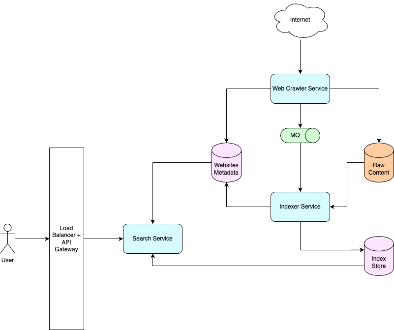

# Search Engine
Design a search engine like Google.

## Functional Requirements
- System should crawl publicly available websites across the internet and build its index. System should periodically crawl same websites to maintain freshness of data.
- System should support keyword-based user queries.
- System should rank websites for a given query based on different signals like relevance and freshness.
- System should return rich snippets (title, URL, snippet from the website etc.).

## Non-functional Requirements
- System should be highly scalable and handle billions of documents and millions of queries per second.
- System should have low latency.
- System should be highly available.
- Newly published pages should appear in results within minutes for some verticals (e.g., news).
- Indexes may be eventually consistent, but search results should feel coherent to the user.

## Resource estimation

### Requirements
- 1B search queries per day.
- 100B documents of size 100KB to index.
- Peak QPS is ~1.5M
- Average query size is 5-10 words.

Given there are 100B documents of size 100KB, `total amount of data to be processed = 100B * 100KB = 10^13KB = 10EB`.

Considering the system returns 10 documents in every search result, `amount of data transferred per day on average = 1B search queries/day x 10 x 100KB = 1EB/day` which translates to `11.5GB/sec`.

## API Design

The system will have 1 user-facing API for search.
```
GET /api/search?q=<text>
```
This will return an array of JSON objects each representing 1 website.

Response:
```json
[
  {
    "url": "URL of the page",
    "title": "Title to show on results page",
    "text": "Small excerpt from the website content",
    "icon": "URL of website icon image"
  }
]
```

## Data Storage

### `WebsitesMetadata` table
This table stores the metadata of different webpages to be / have been crawled. This is structured data and needs to scale for billions of documents. Both SQL and NoSQL DBs will work with indexing on `doc_id`, `url`, `status`.
```
website_id (PK, GUID),
url (String),
last_crawled_at (Timestamp),
status (Enum) (ACTIVE | DELETED | SPAM)
```

### Raw content
Each crawled document needs to be preprocessed before they can be indexed. This includes stripping HTML tags, removing media links, stemming, lemmatization etc. This preprocessed content can be stored in blob/object storage such as Amazon S3, Azure Blob Storage etc.

### Forward Index
This table contains the mapping of `website_id` and list of relevant tokens in its content. This will rarely be updated but requires high read throughput. A key-value store such as `DyanmoDB` will be a good choice.
```
website_id (PK, GUID),
tokens (String[])
```

| Key (website_id) | Value                                  |
|------------------| -------------------------------------- |
| `"abc123"`       | `["travel", "tips", "budget", "2025"]` |

### Inverted Index
The Inverted Index is the core of the search engine, designed for high-throughput and low-latency access. It is heavily sharded (by `term`) to allow for parallel processing by multiple workers, ensuring scalability. To protect live query performance, the index is rebuilt offline in batches to incorporate new content or ranking changes. This approach relies on eventual consistency, where a minor delay in reflecting updates in search results is an acceptable trade-off.

```
term (String),
website_list (GUID, double, int[]) -> (webiste_id, score, snippet_position)
```

| term     | website_list (website_id, score, snippet_position) |
|----------|----------------------------------------------------|
| `travel` | `[(doc1, 0.9, 4), (doc9, 0.75, 2)]`                |
| `budget` | `[(doc1, 0.7, 2), (doc2, 0.85, 1)]`                |

## High Level Design



`Web Crawler service` crawls the internet and updates `WebsitesMetadata` table. It preprocesses crawled data as mentioned in `Data Storage` section and uploads to object storage. After that, it publishes a message to a `Message Queue` to inform `Indexer Service Workers` to start indexing the data.

`Indexer Service` will have multiple workers that can be scaled horizontally. They will consume messages from MQ and accordingly index the raw content from object storage and update the `Index Store`. Thereafter, it will update `WebsitesMetadata` table.

When user sends a search query, it passes through Load Balancer and API Gateway to reach `Search Service`. This service process the query to find relevant keywords based on which it fetches data from `Index Store`. The websites obtained are ranked based on different algorithms and then top n results are chosen. Thereafter, metadata related to these websites are fetched and finally aggregated response is returned to the user.

## Bottlenecks and Scaling

### Caching
Some user queries/keywords may be very hot at times. Results relevant to such queries can be cached in `Search Service`. Before querying the `Index Store`, `Search Service` will first check if results are available in cache already. This way, the system can serve traffic spikes due to hot queries without creating a bottleneck at the database. A LFU or LRU eviction policy can be applied to the cache.

### Query Processing service
Another service can be added for tokenization of user queries and preparing appropriate database queries. Various ML modules can be integrated in this service to extract meaning out of queries and fetch more relevant results. `Search Service` will take help from this service to fetch appropriate database queries and then connect with `Index Store`.

### Compression and Filtering
We compress inverted indexes using delta encoding and variable-length integers, further augmented with block-level compression for better I/O throughput. To avoid unnecessary disk access during term lookup, we place Bloom filters in front of index shards — allowing us to reject non-existent terms early and significantly reduce I/O load.