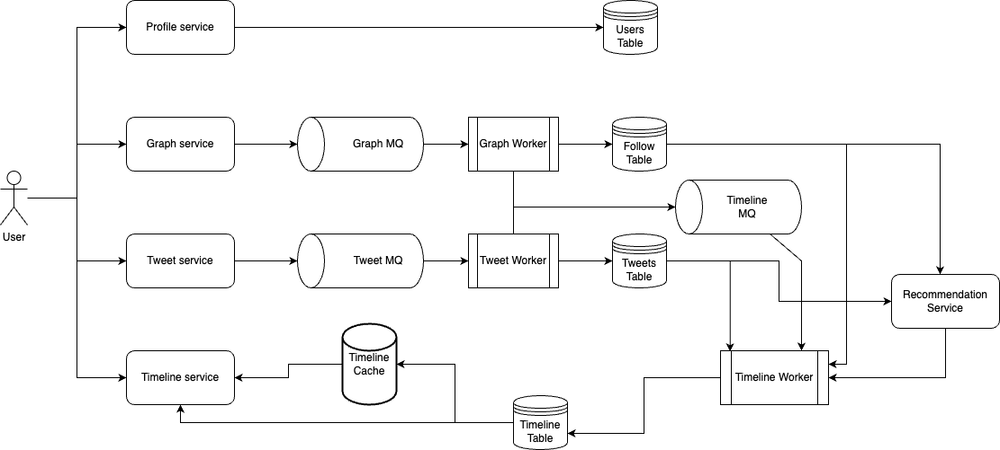

# Twitter
Design a simplified version of Twitter where users can post tweets, follow or unfollow other users, and view the tweets of people they follow.

## Functional Requirements
- Users should be able to write and post new tweets.
- Users should be able to follow or unfollow other users.
- The system should generate timelines for each user where they can see posts from the users they follow, as well as content recommended based on their preferences and interactions.

## Non-functional Requirements
- System should be highly available.
- System should have low latency.
- System should be highly durable/resilient.
- System should be secure.

## Resource estimation

### Requirements
- 300M Daily Active Users
- Each tweet is maximum 140 characters (280 bytes)
- Each user posts 1 tweet per day
- Retain data for 5 years

As read-to-write ratio is not provided, we consider it to be `100:1`.

Given 300M DAU and 1 tweet per user per day, number of write requests per day = 300M.
This translates to `write QPS = 300M / (24 * 60 * 60) = 3472 writes/sec`. <br>
As read:write ratio is 100:1, `read QPS = 100 * write QPS = 3472 * 100 = 347200 reads/sec`.

As each tweet is of 280 bytes, `write bandwidth = size of 1 tweet * number of writes per second = 280B * 3472 = 972KBps = ~1MBps`. <br>
Again, given reads are 100x that of writes, `read bandwidth = 100 x 1MBps = 100MBps`.

Finally, for storage estimations, as we need to retain data for 5 years, `amount of storage needed for 5 years = number of tweets in 5 years * size of 1 tweet = 5 * number of days in 1 year * number of writes per day * 280B = 5 * 365 * 300M * 280B = 153.3TB for 5 years`. <br>
This translates to `84GB of new storage per day`.

## API Design
### For creating a new tweet
```
POST /api/v1/tweets
```
Body:
```JSON
{
  "content": "new tweet"
}
```
User info will be part of auth header. <br>
Response:
```JSON
{
  "status": true,
  "tweetId": "GUID",
  "timestamp": "Date"
}
```
### For retrieving a user's tweets
```
GET /api/v1/tweets?user={userId}&offset={timestamp}
```
Response:
```JSON
{
  "tweets": [
    {
      "tweetId": "tweetId",
      "content": "content",
      "timestamp": "timestamp"
    }
  ]
}
```
### For following and unfollowing a user
```
POST /api/v1/follow/{userId}
DELETE /api/v1/follow/{userId}
```
Response:
```JSON
{
  "status": true
}
```
### For retrieving timeline
```
GET /api/v1/timeline?offset={timestamp}
```
Response:

```JSON
{
  "tweets": [
    {
      "tweetId": "tweetId",
      "userId": "userId",
      "content": "content",
      "timestamp": "timestamp"
    }
  ]
}
```

## Data storage
For write perspective, 300M writes per day generate a huge amount of data. From read perspective, the system needs to handle a tremendous amount of read requests, however, it does not have any complex query requirements. Moreover, new posts do not need to be immediately available to all users. Considering these points, a NoSQL database with eventual consistency like `Cassandra` would be a good choice. It can handle large amount of data and has high write speed.

### Schema

#### Users Table
```
userId : UUID (primary key)
name : String
email : Email
password : String
createdAt : Timestamp
```

#### Tweets Table
```
tweetId : UUID (primary key)
userId : UUID
content : String
createdAt : Timestamp
```

#### Follow Table
```
followId: UUID (primary key)
followerUserId : UUID
followedUserId : UUID
```

## High-level Design


The system can be divided into 4 user-facing microservices.

### Tweet service
Tweet service is responsible for handling all tweets and corresponding reads and writes. In order to reduce the response time for write requests, the service will not interact with database directly. Rather, the request will be published to a message queue and a response will be returned to the user immediately. 

Tweet workers will consume these messages and update Tweets table accordingly. Along with that, the workers will also publish the message to Timeline message queue for updating the timeline of interested followers.

### Graph service
Graph service takes care of followers of all users. Any follow/unfollow request is handled by this service. Graph service also has its dedicated message queue to reduce response time to users. Graph workers consume messages and update Follow table accordingly.

Workers will also publish messages to Timeline message queue as timeline for a user needs to be updated in case they follow/unfollow another user.

### Timeline service
Timeline service generates timelines for all users. It has 4 data sources to consume from - messages published to its message queue by Graph and Tweet services, Follow table, Tweets table and Recommendation service running in the background. It creates a timeline for each user and stores it in Timeline cache for fast access and Timeline DB for persistence. When a new tweet is published, timelines of all the followers of the author has to be updated. This leads to celebrity problem which is discussed  in `Bottlenecks and Scaling` section.

Cached timeline for each user is updated periodically. This is needed for cases where a user logs in after a while, and we don't want them to get a stale timeline. If a user a scrolling through their timeline, before reaching the end of the cached timeline, the system will append new items to its end. If the user scrolls very fast, then they may have to wait for a couple of seconds for newer posts while the system fetches other items from the DB. Scrolling essentially means calling the timeline API in the background with the offset timestamp of the last post in current list.

Recommendation service makes use of Tweets and Follow table along with other analytics data like User interactions with different genre of posts.

### Profile service
Profile service handles all user profiles. Graph service interacts with this service for obtaining user profiles.

## Bottlenecks and Scaling

### Celebrity problem
When a user having millions of followers (celebrity) posts a tweet, it is inefficient to update all the followers timelines at once as it would create a huge load on the system. Instead, the tweet can be added to a subset of followers' timelines - possibly followers who have recently interacted on posts of the celebrity. For rest of the followers, the tweet will be asynchronously added to the Timeline DB by workers and will be fetched into Timeline cache when the user call Timeline API next.

### Database partitioning
Since a huge number of tweets are getting written and read daily, having a single DB partition will overload the server. Partitioning the data and storing them in different DB shards will help evenly distribute the traffic.

The DB could be partitioned by UserId but this would lead to Celebrity problem. Celebrities have millions of followers who often query celebrities' tweets. This would overload the Tweets table's shard that has all the posts from that celebrity.

Instead, partitioning can be done on TweetId. This will ensure that not all tweets from a single user will land on the same partition. For this approach, an efficient key generation algorithm has to be implemented. Unique IDs can be auto-incrementing values such as an integer or timestamp. To ensure uniqueness across multiple instances of write servers, this value can be concatenated with the instance ID of the server.
> This is similar to Twitter's Snowflake IDs.

### Database replication
Data should be backed up across different availability zones as well as regions. 

Availability zones are located in the same region but have different power supply and network configuration. This ensures the power supply or network interruptions don't affect all replicas at the same time. Again since these zones are in the same region, in case of a fail-over, when the backup zone is serving requests, users won't experience increased latency.

Regional backups are necessary to avoid natural disasters (e.g., flood, fire etc.) or civil unrest.

Back up should be done regularly - either full or incremental.

### Caching
Most recent or popular tweets can be stored in and served from a cache service (like Redis) to ensure low latency and high availability. Timeline cache is already mentioned above. Apart from that, popular tweets and celebrity profiles can be cached.

LRU is a suitable eviction policy for this cache as we only want to store most popular data that is accessed very often. A cache-refresh strategy is also need as users may update their profiles or edit their tweets. We could either use a write-through cache (any writes will first update the cache and then update the DB) or add a TTL to each entry of the cache.

### Timeline update for follow/unfollow
For any follow/unfollow requests, Graph service publishes an event to the Timeline MQ. Accordingly, timeline service can update the user's timeline.

When a user follows someone, the recent tweets of the followed user can be added to the follower's timeline immediately. As the user scrolls through their timeline, the service has to check for recently followed users and add more of their tweets to the timeline. When a newer timeline is generated, these users will be accounted for automatically.

Again, when a user unfollows someone, timeline service will remove their tweets from the timeline. This can be done asynchronously as it is okay to view a few tweets from a recently unfollowed user.

### Rate limit
Rate limiting can be implemented in the system to prevent abuse. This can be done on UserId as all APIs are available to authenticated users only. Further, another layer of restriction can be added on IP address to prevent abuse of public APIs like Sign Up/Register.

## Follow-up questions

1. How would you handle analytics?

