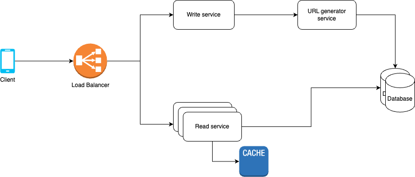

# URL Shortener
Design a URL Shortener service like bit.ly

## Functional Requirements
- Given a URL, the service should generate a shorter and unique alias of it.
  - The shortened URL should be unique across all users.
  - The shortened URL should be as short as possible to save characters.
  - The shortened URL should use only English alphabet letters (a-z, A-Z) and digits (0-9).
- If a user accesses a shortened URL, the service should redirect them to the original URL.
- The service should be able to keep track of the number of times a short link has been accessed.

## Non-functional Requirements
- The service should have low latency.
- The service should be highly available.
- The service should be persistent, consistent and reliable.
- The service should be secure.

## Resource estimation

### Requirements
- 100M Daily Active Users
- Read:write ratio = 100: 1
- Data retention for 5 years
- 1 million write requests per day
- Each entry is about 500 bytes

Given, 1M write requests per day, `write QPS = 1M/(24x60x60) = 11.57 ~= 12`.

Since read requests are 100x that of writes, `read QPS = 100*11.57 = 1157`.

As each entry is approx. 500B, and we want to retain data for 5 years, `amount of storage required for 5 years = (size of each record)x(number of write requests per day)x(number of days in 5 years) = 500B x 1M x 365 x 5 = 912.5 GB`. This translates to `182.5 GB per year` or `15.2 GB per month`.

Given 1157 Read QPS, `bandwidth required for read requests is 1157 x 500B = 578 KBps` <br>
Similarly, `bandwidth required for write requests is 6 KBps`.

Given, 1M writes per day, `number of unique URLs in 5 years = 1M x 365 x 5 = 1.825B`.
As we will use the English alphabet and digits 0-9 only in the URL, `an URL of length 6 can have 56B combinations` which should suffice our requirement.

## API design
### API for shortening a URL
```
POST /api/url/short
```
Body:
```JSON
{
  "url": "http://example.com"
}
```
Response:
```JSON
{
  "shortUrl": "http://url.ly/xyz"
}
```
### API for getting original URL for given short URL
```
GET /api/url/{shortUrl}
```
Response:
```JSON
{
  "url": "http://example.com"
}
```
Another way for URL redirection would be to return a 302, 303 or 307 (depending on HTTP verb preservation requirements) response with `url` in Location header. The browser will automatically redirect to that URL.

## Data Storage
We want to store a mapping of `originalURL` and corresponding `shortURL`. Also, since the service wants to keep track of the number of times a short URL is accessed, we can store a `accessCount value` for each mapping.

`Url` table schema:
```
id (primary key, auto-incrementing)
originalUrl (original URL provided by user)
shortUrl (shortened URL corresponding to originalUrl)
createdAt (timestamp of creation)
createdBy (userId of user who created this URL, optional)
accessCount (number of times this shortUrl is accessed)
```

The schema is very simple and can be stored in any SQL (e.g., MySQL) or NoSQL (e.g., Amazon DynamoDB) database. The DB can be sharded and indexed on `shortUrl` to optimize read requests which is supported by both SQL and NoSQL DBs. `accessCount` can be updated asynchronously to reduce write load.

As we want to retain data of last 5 years only, a cronjob can be run in the background every 24 hours to find and remove stale entries. Latency of a few hours is tolerable for this operation, so we don't need to optimize this query. Instead of actually removing stale entries, they can be archived to some data-lake (e.g., Amazon S3) for long-term storage and analysis. Amazon Redshift is also a good choice for data warehousing and analytics.

## High-level design


### Read service
This service is responsible for serving all read requests. We may need to scale this horizontally (increasing number of instances) to handle all read requests with low latency.

### Write service
This service is responsible for serving all write requests. Number of write requests are significantly lower than reads, so ideally this service should require less scale-out. However, latency of this service would depend on the URL generator service's efficiency.

### URL generator service
This service is responsible for generating short URLs and ensuring that there is 1:1 mapping between original URL and short URL.
There are multiple ways in which a unique shortUrl can be generated.

#### UUID/GUID/Hash
UUID generators generate random numbers to ensure uniqueness. The probability of collision is negligible. However, they are of 32 characters which is a bit too long for our service.

Standard hash functions like MD5 or SHA256 also ensure uniqueness with negligible collision probability. OriginalUrl can be hashed to generate a unique ID. But they are also too long for our service (32 characters).

#### Custom generator
Unique IDs can be generated by write service itself using an auto-incrementing value. Auto-incrementing value can be simply an integer or timestamp. To ensure uniqueness across multiple instances of write servers, this value can be concatenated with the instance ID of the server.
> This is similar to Snowflake IDs.

This algorithm is very fast as each server instance can work independently, and it doesn't involve complex hashing algorithms.

The generated URL can be further compacted by encoding it to hexadecimal, Base62, Base64 etc.

### Bottlenecks and Scaling

#### Database Sharding
As mentioned above, the DB is sharded by shortUrl. This helps in scaling both read and write requests. <br>
Read requests would contain the shortUrl which can be used to determine which shard the record resides in. On the other hand, write servers concatenate instance ID to shortUrl, so it creates a locality in shortUrls generated by same instance. Hence, these instances need to connect to their specific shards only for writing. <br>
Hence, it is easy to scale both read and write services independently.

#### Database replication
Database should be replicated in multiple locations to ensure high durability. Number of replicas depends on various factors such as criticality of the data, cost implications etc.

For each write requests, we may choose to write it on all DB replicas before returning a response to user. But that would increase latency. Alternatively, we can write the data in 1 DB instance and a write-ahead log and then return a response while eventually updating rest of the replicas. This will reduce latency. Given, low read QPS and database sharding in place, reads can be served by 1 instance from each shard. So, eventually consistent replicas won't cause phantom read/write issue.

#### Caching
Some of the short links may be read much more than the others. As we are already storing accessCount of each URL, it should be easy to analyse. Considering 20% of records serving 80% of traffic, it amounts to `182.5/5 GB = 36.6GB` of data. This is a small amount and can be stored in a cache and served from there instead of hitting the DB.

Once a short URL is created for a URL, there will be no modifications to it. A simple LRU cache should suffice our requirements, we don't need any TTL on cache records. But we do need to remove entries that are deleted after 5 years because corresponding shortURls may be reused (i.e., a TTL of close to 5 years).

#### Unique URL generation across multiple threads on same machine
1 server machine can run multiple threads to handle multiple write requests at a time. So the above-mentioned URL generator logic can cause collisions. Solution is to add threadId to the shortURL along with instanceId and timestamp.

#### Load Balancer
A load balancer has to be placed in between users and servers to redirect read and write requests to appropriate microservices. 

Also, in case of traffic spikes when each service has to be scaled out, a load balancer is need to distribute the requests efficiently. As the servers are stateless, a simple strategy like forwarding requests to the server having the lowest load should suffice. Alternatively, requests can be forwarded to the server closest to the user geographically. Telemetry data can help identify patterns and determine the optimal algorithm.

## Follow-up questions
1. What if we store user profiles and want to quickly fetch all the URLs created by a user?
    > We can create an index on `createdBy` field in `Url` table.
2. How would you handle Analytics?
3. How to handle URL generation if there is a sudden influx of write requests?