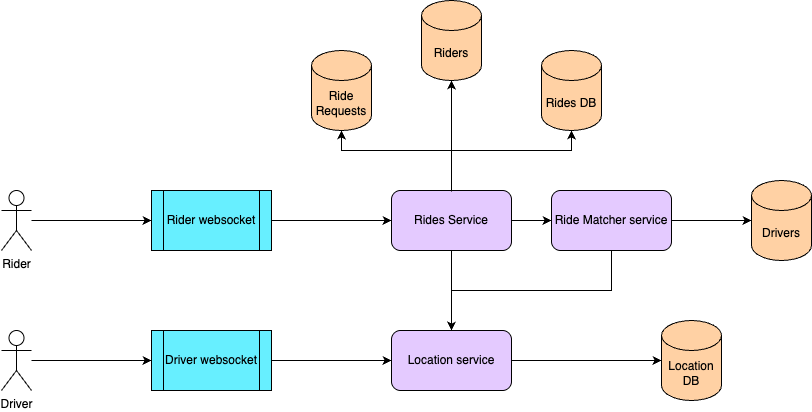

# Uber
Design a cab aggregator service like Uber.

## Functional Requirements
- Rider should be able to request for a ride from current location to a destination.
- Driver should be able to accept/reject ride requests.
- If a driver is a matched to a ride, rider should be able to track driver location till end of the trip.
- Service should try to match nearest available driver to a ride.

## Non-functional Requirements
- System should be highly available.
- System should be consistent i.e., same rider/driver shouldn't be matched to multiple drivers/riders at the same time.
- System should have low latency. Riders should be able to track driver locations in real-time.
- System should be scalable.

## Resource estimation

### Requirements
- 100M Daily Active Users
- Read:write ratio = 10:1
- 10 million ride requests per day
- Each ride information object is 1KB
- Data retention for 5 years

Each ride request generates a write request. So for 10M ride requests per day, `write QPS = 10M/(24*60*60) = ~116 writes/sec`.
<br>Since read:write ratio = 10:1, `read QPS = ~1160 reads/sec`.

Given, each ride object is 1KB is size, `amount of data produced per day = 10M * 1 KB = 10GB`
which translates to a required bandwidth of `~115KBps`.

Again, since 5 years worth of ride requests need to be retained, `amount of storage needed = 10GB x 365 x 5 = 18.25 TB in 5 years`.

## API Design

### Websocket connection
Driver and rider location tracking will be handled by `Location Service`. Drivers and rides will be connected to the service via some bidirectional communication protocol (e.g., websockets) to receive and share real-time location data.

#### API for connecting to service
```
wss://api.uber.com
```

#### Client to server messages
1. Location update (driver)
    ```json
    {
      "type": "location_update",
      "lat": "{{Float}}",
      "lng": "{{Float}}"
    }
    ```
2. Accept ride (driver)
    ```json
    {
      "type": "ride_accept",
      "rideId": "{{String}}"
    }
    ```
3. Cancel ride (rider and driver)
    ```json
    {
      "type": "ride_cancel",
      "rideId": "{{String}}"
    }
    ```

#### Server to client messages
1. Ride assigned
    ```json
    {
      "type": "ride_assigned",
      "rideId": "abc123",
      "pickup": 
      { 
        "lat": "{{Float}}", 
        "lng": "{{Float}}"
      }
    }
    ```
2. Driver location
    ```json
    {
      "type": "driver_location",
      "rideId": "{{String}}",
      "lat": "{{Float}}",
      "lng": "{{Float}}"
    }
    ```
3. Ride status update
    ```json
    {
      "type": "ride_status_update",
      "rideId": "{{String}}",
      "status": "ARRIVED | STARTED | COMPLETED | CANCELLED"
    }
    ```
   
### Other management APIs
#### For riders
- `POST /api/rides/request` → Rider requests a ride with pickup/drop locations.
<br>Request:
    ```json
    {
      "userId": "{{String}}",
      "pickup": {
        "lat": "{{Float}}",
        "lng": "{{Float}}"
      },
      "drop": {
        "lat": "{{Float}}",
        "lng": "{{Float}}"
      }
    }
    ```
    <br>Success Response:
    ```json
    {
      "rideId": "{{String}}",
      "driverDetails": {
        "carNumber": "{{String}}"
      },
      "driverLocation": {
        "lat": "{{Float}}",
        "lng": "{{Float}}"
      },
      "eta": "{{Integer}}",
      "price": "{{Float}}"
    }
    ```
- `GET /api/rides` → Get ride status/history.
  <br>Response:
    ```json
    {
      "rides": [
        {
          "rideId": "{{String}}",
          "pickup": {
            "lat": "{{Float}}",
            "lng": "{{Float}}"
          },
          "drop": {
            "lat": "{{Float}}",
            "lng": "{{Float}}"
          },
          "price": "{{Float}}",
          "timestamp": "{{Timestamp}}"
        }
      ]
    }
    ```
#### For drivers
- `POST /api/driver/availability` → Set driver as available/unavailable. If made available, driver creates a websocket connection with the service.
  <br>Request:
    ```json
    {
      "availability": "AVAILABLE | UNAVAILABLE"
    }
    ```
- `GET /api/driver/rides` → Get history of rides.
  <br>Response:
    ```json
    {
      "rides": [
        {
          "rideId": "{{String}}",
          "pickup": {
            "lat": "{{Float}}",
            "lng": "{{Float}}"
          },
          "drop": {
            "lat": "{{Float}}",
            "lng": "{{Float}}"
          },
          "price": "{{Float}}",
          "timestamp": "{{Timestamp}}"
        }
      ]
    }
    ```
## Data Storage
Following schemas include only the basic columns. More can be added as per requirements.

### `Riders` table
```
rider_id (PK)
name (string)
created_at (timestamp)
```
Structured data with ACID requirements. RDBMS like MySQL will be a good choice.

### `Drivers` table
```
driver_id (PK)
name (string)
created_at (timestamp)
status (AVAILABLE | OCCUPIED | OFFLINE)
```
Structured data with ACID requirements. RDBMS like MySQL will be a good choice.

### `Rides` table
This table stores all historical rides. Older records can be moved to cold storage in batches.
```
ride_id (PK)
driver_id (FK)
rider_id (FK)
pickup_location
drop_location
status (REQUESTED | IN PROGRESS | COMPLETED | FAILED | CANCELLED)
timestamp
```
This table stores all historical rides. Older records can be moved to cold storage in batches. <br>
Structured data with ACID requirements. RDBMS like MySQL will be a good choice.

### `RideRequests` table
```
ride_id (PK)
rider_id
pickup_location
drop_location
created_at (timestamp)
status (REQUESTED | IN PROGRESS | COMPLETED | FAILED | CANCELLED)
```
This table contains all pending requests where driver hasn't been assigned yet. It is similar to `Rides` table. It will help fetch pending requests quickly without having to go through all historical requests. <br>
Structured data with ACID requirements. RDBMS like MySQL will be a good choice.

### `Location` table
```
location_id (PK)
driver_id (FK)
location
last_updated (timestamp)
```
This table stores the real-time location of all drivers. It will have to handle huge number of reads and writes. It will be used for ride matching as well as driver tracking for matched rides. As we don't need to store historical location for any driver, we will have only 1 record per driver in this table. Also, if data is lost somehow, whenever a driver connects to the system, location will be updated again. So we need high read/write throughput, low latency, no persistence. An in-memory DB will serve best for these requirements.

As this table will be used for fetching nearest drivers, a simple SQL DB would require complicated queries with high time complexity. We need something optimized for 2D location queries. There are multiple off-the-shelf solutions for this.
- **Geohashing**: Geohashing encodes latitude and longitude into a single string, dividing the world into a grid of cells. Nearby locations have similar prefixes, thus allowing quick search based on prefix length. However, there are edge cases where nearby points can land in different cells, thus complicating query logic. `ElasticSearch`, `Redis` etc. provide this feature.
- **Quadtree**: It recursively divides the entire world into 4 quadrants. It can handle fine-grained data by increasing the depth of recursion tree. Frequent updates are not handled efficiently, so it is not suitable for tracking cars which are moving entities. Also, neighboring objects might end up in different branches, making nearest-neighbor queries expensive without additional spatial logic.
- **Google S2**: This utilizes Hilbert Curves that map multidimensional data into 1D. It divides the earth's surface into hierarchical cells preserving locality of points. It is efficient for large-scale geographic data, but it is hard to implement and maintain.
- **H3**: Uber has developed an in-house geospatial indexing system for its use case. It divides the surface into hexagonal cells. Hexagons are very efficient in space-filling.

## High-level Design


**Ride Flow**
1. Driver is logged in and has a WebSocket connection established with system websocket service.
2. Driver is sharing location to `Location Service` at regular intervals.
3. Rider logs in and creates a WebSocket connection with the service.
4. Rider requests for a ride which goes to `Rides Service`.
5. `Rides Service` adds the request in `Ride Requests` DB and requests `Ride Matcher service` to match a driver.
6. `Ride Matcher service` gets nearest available driver from `Location service` and `Drivers` DB.
7. Once ride is matched, `Rides Service` updates status in `Ride Requests` and `Rides` DB.

Apart from this, there will be a `Users Service` to manage riders (account creation, auth etc.). Similarly `Drivers Service` would take care of handling all driver accounts.

## Bottlenecks and scaling

### In-memory database
`Location DB` will have to handle a huge amount of read and write traffic. Since data persistence is not required and there will be only 1 entry per driver, in-memory database can be used for this purpose.

### Sharding
Drivers and riders are mostly in the same geographical area. So `Locations DB` can be sharded by the location itself and different machine instances containing these shards can be placed in their respective location. Consequently, the entire service can have scaled horizontally across geographical locations to reduce latency with location-aware load balancer between clients and servers.

### Replication
Apart from `Location`, other DBs can be replicated in different availability zones to improve resiliency. `Location` DB doesn't need to be replicated as it need not be persistent. However, if some additional cost is tolerable, `Location DB` can also be replicated for higher availability so that all driver locations are not lost in case a machine goes down.

### Websocket scaling
As millions of websocket connections need to be handled at a time, it is preferable to create sticky sessions. That way, the server can cache certain data e.g., ride data for a driver-rider pair. Also, for drivers sending frequent location updates (e.g., every second), updates can be batched or throttled to reduce traffic.