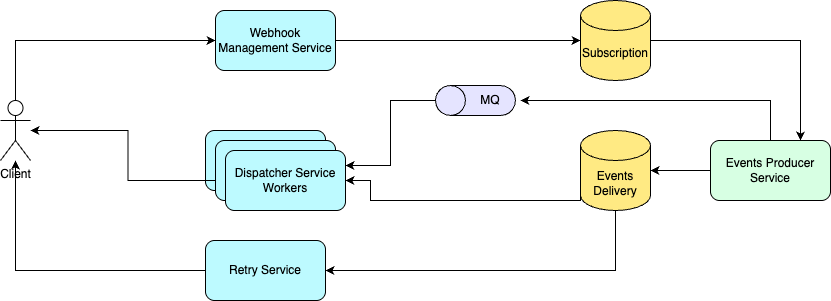

# WebHook
Design a WebHook system

## Functional Requirements
- Clients should be able to register to the webhook service along with event types they are interested in.
- Clients should be notified on registered URLs when events they're interested in happen.
- Security is an important consideration as clients will be open to receiving communication from the service.
- Guarantee ordering of events per webhook subscriber (especially for related events).
- Allow clients to list, update, delete their webhook subscriptions.

## Non-functional Requirements
- System should be scalable and should be able to handle millions of webhook events every day.
- System should be reliable and should guarantee at-least-once delivery.
- System should have low latency.
- System should be durable and persist undelivered events until they're successfully delivered or expired.

## Resource estimation

### Requirements
- 1M webhook events per day with 5x increase during spikes.
- Default expiry of events is 30 days.
- All delivered/undelivered events should be retained for 30 days.
- Each event size is 5KB.

During peak hours, as traffic increases by 5x, `5M events need to be processed and delivered`.

As each event is of size 5KB, `average bandwidth required = 1M x 5KB /day = 57KB/s`. This can go up to `57 x 5 = 285KB/s during peak hours`.

Given, events need to be stored for 30 days, `amount of storage needed for usual traffic = 1M x 5KB x 30 = 150GB`.

## API Design
1. Register a WebHook
    <br>`POST /webhooks`
    <br>Request:
    ```json
    {
      "url": "https://client.example.com/webhook",
      "event_types": ["document.created", "document.updated"]
    }
    
    ```
    <br>Response:
    ```json
    {
      "webhook_id": "wh_12345",
      "status": "active"
    }
    ```
2. Get WebHook Details
   <br>`GET /webhooks/{webhook_id}`
   <br>Response:
    ```json
    {
      "webhook_id": "wh_12345",
      "url": "https://client.example.com/webhook",
      "event_types": ["document.created"],
      "status": "active",
      "created_at": "2025-05-07T12:00:00Z"
    }
    ```
3. List all WebHooks
   <br>`GET /webhooks`
   <br>Response:
    ```json
    {
        "webhooks": [
            {
                "webhook_id": "wh_12345",
                "url": "https://client.example.com/webhook",
                "event_types": ["document.created"]
            },
            {
                "webhook_id": "wh_67890",
                "url": "https://client.example.com/user-webhook",
                "event_types": ["user.updated"]
            }
        ]
    }
    ```
4. Update a WebHook
   <br>`PUT /webhooks/{webhook_id}`
   <br>Request:
    ```json
    {
      "url": "https://new.example.com/webhook",
      "event_types": ["document.deleted"]
    }
    ```
   <br>Response:
    ```json
    {
      "status": "updated"
    }
    ```
5. Delete a WebHook
   <br>`DELETE /webhooks/{webhook_id}`
   <br>Response:
    ```json
    {
      "status": "deleted"
    }
    ```
6. Deliver an event (initiated by Server)
   <br>`POST https://client.example.com/webhook`
   <br>Request:
    ```json
    {
      "event_id": "evt_abc123",
      "event_type": "document.created",
      "timestamp": "2025-05-07T12:34:56Z",
      "payload": {
        "document_id": "doc_7890",
        "created_by": "user_123"
      }
    }
    ```
   
## Data Storage

### `Subscription` table
Stores registered webhook subscriptions of all users. We can use relational DB (e.g., `Postgres`, `MySQL`) for this table because it’s structured, transactional and queryable. It can be indexed on `user_id` and `event_types` to quickly fetch subscriptions of a particular user or all subscriptions for a particular event type.
<br>Schema:
```
webhook_id (UUID, PK)
user_id (UUID)
callback_url (string)
event_types (Enum[])
status (Enum (ACTIVE/INACTIVE))
created_at (timestamp)
```

### `EventsDelivery` table
Records delivery attempts and results for observability and retries. This table will have to handle high read and write traffic. As we need at-least-once delivery guarantee, strong ACID properties are not necessary. Keeping these in mind, a non-relational DB like `MongoDB` would be a good choice. This table can be indexed on `status` to quickly fetch failed deliveries and retry them.

Also, if `payload` or `response_message` are too long, they can be stored separately in object storage and keep references here.
<br> Schema:
```
delivery_id (UUID, PK)
event_id (UUID)
webhook_id (UUID, FK)
event_type (Enum)
payload (JSON)
status (Enum)
retry_count (integer)
delivery_time (timestamp)
response_code (integer)
response_message (string)
```

## High-level Design


`Webhook Management Service` handles the creation, updates and management of webhooks. This service exposes CRUD APIs for webhooks. This service stores registered webhooks in `Subscription` table.

`Events Producer Service` creates new events from external triggers. It creates individual events for each subscriber using data from `Subscription` table and stores in `Events Delivery` table. It also publishes the events to a Message Queue for async handling.

`Dispatcher Service` workers consume events from the message queue and attempt delivery to clients. Status is updated in `Events Delivery` table according to success or failure. `Retry Service` retries failed deliveries for a fixed number of times before abandoning them permanently.

## Bottlenecks and scaling

### Dispatcher scalability
`Dispatcher service` has to deliver millions of events daily and can easily become a bottleneck. This will lead to high latency, failed deliveries and increased retries. To resolve this, dispatcher service should have multiple workers that can be scaled horizontally as per traffic. Also, `event delivery message queue` can be sharded by event type and dedicated dispatcher workers can be created so that they can scale independently.

### Retry backlog
Misconfigured or flaky client URLs can lead to significant increase in retry backlog. This leads to wastage of immense resources in `Retry Service`. Hence, retries should be handled by a separate service instead of `Dispatcher service` itself. Exponential backoff should be used while retrying for the same client URL. Also, a max retry limit should be set and thereafter the event should be expired.

### Metadata cache
Each time an event needs to be dispatched to a certain webhook, all metadata related to the webhook is required. This info can be cached in `Dispatcher Service` and `Retry Service` for heavily used webhooks.

## Security
Security is critical in webhook system since client URLs are exposed over public internet — anyone can POST data to them. Following measures can be taken to secure such a system.

### Authentication
Only signed payloads should be accepted by client endpoints (e.g., `HMAC-SHA256`). When a client registers a webhook, generate a secret key (e.g., per-client or per-webhook). When sending a webhook event, compute HMAC over payload using the secret key and include the signature in header. Client receiving the webhook will verify the signature using their secret. Secrets should be rotated periodically.

### Secure client URLs
Enforce HTTPS-only client URLs. Use TLS 1.2 or higher. Optionally validate server certificates — prevent MITM attacks. Reject IPs with self-signed or expired certs.

Validate webhook URLs at registration time and before each dispatch. Block internal IPs (e.g., `127.0.0.1`, `169.254.x.x`, `10.x.x.x`, etc.)

### Rate Limiting + Circuit Breakers
To protect from malicious clients, implement per client rate limits, circuit breakers for clients failing consistently and exponential backoff on retry attempts.

> On top of all of these, implement proper audit and monitoring system to identify malicious clients.
