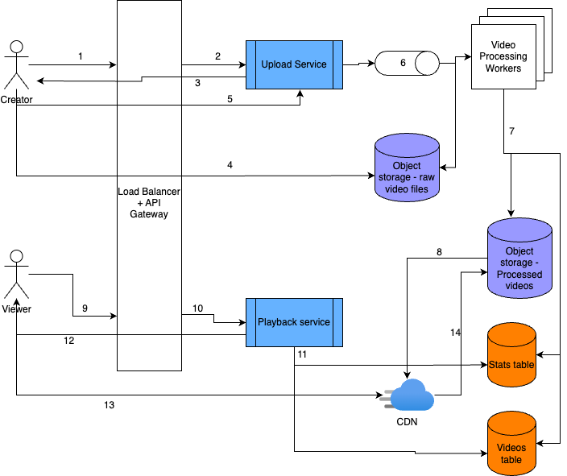

# Youtube
Design a video sharing platform like Youtube.

## Functional Requirements
- Viewers should be able to view a video by clicking on its thumbnail or visiting its URL.
- Viewers should be able to like and comment on videos as well as check likes and comments on all videos.
- Creators should be able to upload videos to their channel.
  - Creators should receive success/failure message once a video upload is completed/failed/aborted.
  - If a video upload is successful, a URL should be provided which can be accessed by all viewers.
- Creators should be able to view a list of their uploaded videos and engagement on them.

## Non-functional Requirements
- System should be highly available and resilient to traffic spikes.
- System should be compatible across different user devices and network quality.
  - Video quality should be optimized based on device capability and network quality.
- Video file uploads should be smooth and fast.
- System should be persistent: Uploaded videos should be persisted until expiry.
- System should be scalable and should have low latency.

## Resource estimation

### Requirements
- 100M Daily Active Users
- Read:Write ratio = 100:1
- Each user watches 5 videos a day on average.
- Each creator uploads 1 video a day on average.
- Each video size is 500MB on average.
- Videos should be retained for 10 years.

Given `100M DAU` and 5 watches per day per user, `number of read requests per day = 500M`
which corresponds to 500M/(24*60*60) = `5.8K Read QPS`.

Since number of writes is 1/100th of reads, `write QPS = ~58 QPS`.

Considering 500M reads and 100:1 read:write ratio, we can say `number of video uploads per day = 5M`
which translates to 5M * 365 * 10 = `18.25B video uploads in 10 years`.

Thus, `the amount of storage required is 18.25B x average size of each video = 18.25B x 500MB = 18.25 x 10^9 x 5 x 10^2 x 10^6 = 9.125 x 10^18 B = ~9.2EB over 10 years`

## API Design

### APIs for viewers

#### API to stream a video
1. Client first calls YouTube's streaming API
```
GET /api/stream?id={video_id}
```
Example JSON response:
```JSON
{
  "video_id": "{video_id}",
  "stream_url": "https://cdn.youtube.com/stream?v={video_id}",
  "content_length": 50000000,
  "mime_type": "video/mp4",
  "bitrate": 5000000,
  "resolution": "1920x1080",
  "duration": 300,
  "supports_range_requests": true
}
```
The `stream_url` is where the actual video chunks are available.
2. Client Requests a Video Chunk from `stream_url`
```http
GET https://{cdn_url}/stream?v={video_id}
Range: bytes=1000000-1999999
```
Response:
```http
HTTP/1.1 206 Partial Content
Content-Range: bytes 1000000-1999999/50000000
Content-Type: video/mp4

[binary video data in MIME format...]
```
YouTube client calls this CDN API multiple times with increasing `Content-Range`.

#### API to check likes and comments on a video
```
GET /api/video/metadata?id={video_id}&commentsRange={offsetStart-offsetEnd}&commentsSortBy={popular|time}
```
JSON response:
```JSON
{
  "video_id": "{video_id}",
  "created_at": "{date}",
  "channel_name": "{channel_name}",
  "likes": "integer",
  "comments": [
    {
      "comment_id": "{id}",
      "content": "{comment}",
      "timestamp": "{date}",
      "author": "{user_id}"
    },
    ...
  ]
}
```

#### API to like a video
```
POST /api/video/like?id={video_id}

Body:
{
  "like_type": LIKE | DISLIKE
}
```
JSON response:
```json
{
  "is_successful": true | false,
  "message": "{error message if any}"
}
```

#### API to comment on a video
```
POST /api/video/comment?id={video_id}

Body:
{
  "content": "comment string"
}
```

JSON response:
```json
{
  "is_successful": true | false,
  "message": "{error message if any}"
}
```

### API for creators

#### API to upload a video
1. Client first calls YouTube's upload API
```
POST /api/upload/initiate

{
    "file_name": "my_video.mp4",
    "file_size": 50000000,
    "chunked": true
}
```
Response from YouTube server:
```JSON
{
  "upload_url": "https://video-platform.com/api/upload/12345",
  "upload_id": "{upload_id}",
  "chunked": true
} 
```
2. If file is small, it can be uploaded as a single chunk
```http
POST /api/upload/{upload_id}
Host: video-platform.com
Authorization: Bearer YOUR_ACCESS_TOKEN
Content-Type: video/mp4
Content-Length: 50000000

[binary video data]
```

Else, it can be uploaded in chunks
```http
PUT /api/upload/{upload_id}
Host: video-platform.com
Authorization: Bearer YOUR_ACCESS_TOKEN
Content-Type: video/mp4
Content-Range: bytes 0-999999/50000000

[binary video data]
```
Here, `Content-Range` is provided instead of `Content-Length`.

3. Once all chunks are uploaded, the client notifies the server.
```
POST /api/upload/complete

{
    "upload_id": "{upload_id}"
}
```
Response JSON contains `video_id`:
```json
{
    "video_id": "{video_id}",
    "status": "processing"
}
```
4. Creator can check for video upload status using the `video_id`
```
GET /api/upload/status?id={video_id}
```
JSON response:
```json
{
    "video_id": "{video_id}",
    "status": "ready",
    "stream_url": "https://video-platform.com/watch?v={video_id}"
}
```

#### API to get a list of all videos uploaded by user
```
GET /api/channel/metadata?id={channel_id}
```
JSON response:
```json
{
  "channel_id": "{channel_id}",
  "user_id": "{user_id}",
  "uploadedVideos": [
    "video_id_1", "video_id_2",...
  ]
}
```
Video IDs can be further used to retrieve metadata.

## Data Storage
We need a `Videos` table to store metadata of each video and a `Stats` table to store frequently changing statistics of each video, e.g., likes, commentsCount etc. We also need a `Comments` table to store all comment threads for each video. Finally, we need a `Users` table to store all user information.

Apart from these, we need an object storage for storing actual video files. `Videos` table will contain a list of links to different video formats.

`Videos` table schema:
```
video_id (PK)
creator_id (FK of user_id in Users table)
created_at (timestamp)
file_paths (List of URL)
tags (List of string)
description (String)
thumbnail (URL)
duration_in_sec (integer)
```
This is a highly structured data, so we can use a RDBMS like MySQL. The table can be indexed on `video_id` for fast lookups. An additional index on `creator_id` can be created to quickly fetch list of videos of a particular user.

`Stats` table schema:
```
video_id (FK)
views (integer)
likes (integer)
comments_count (integer)
share_count (integer)
watch_time_in_mins (integer)
```
This table will have to handle high read and write traffic. It is okay to show slightly stale data to users to eventual consistency is fine. With these requirements in mind, a NoSQL database like MongoDB would be a good fit. This table should be indexed on `video_id` for fetching stats quickly once video is loaded on client devices.

`Users` table schema:
```
user_id (PK)
name (string)
created_at (timestamp)
password_hash (string)
email (string)
```
This is again very structured data. So a RDBMS table with index on `user_id` will do.

`Comments` table schema:
```
comment_id (PK)
parent_comment_id
video_id (FK)
created_at (timestamp)
user_id
```
This is a simple schema for `Comments` table. `parent_comment_id` helps create and maintain long threads. This table will have high read and write traffic. So, a NoSQL DB like MongoDB with index on `video_id` can be used. An additional index on `user_id` can be created to quickly fetch all comments of a user.

## High-level Design

### Creator flow
1. Creator triggers upload API.
2. Request is validated by API gateway and forwarded to `Upload Service`.
3. `Upload Service` responds with an URL to an object storage where raw video file can be uploaded. Either a signed URL or a auth token is sent with the response so that creator can authorize to the object storage.
4. Creator uploads raw video to the object storage.
5. Once upload is complete, creator triggers a completion API.
6. Upon receipt of the completion request, `Upload Service` publishes an event to a Message Queue which is picked up by one of the video processing workers. This is handled asynchronously to balance the load on the workers.
7. Once processing is complete, processed video files are uploaded to object storage and required data is published to `Videos` and `Stats` tables.
8. Popular videos are uploaded to CDNs from object storage.
### Viewer flow
9. Viewer triggers the stream API.
10. Request is validated by API gateway and forwarded to `Playback Service`.
11. `Playback Service` fetches streaming URL and other data from `Videos` and `Stats` table.
12. `Playback Service` responds to viewer with the above data.
13. Viewer streams the video from CDN.
14. If video is not available to CDN, it is fetched from object storage.

## Bottlenecks and scaling

### Load Balancing
The service has to handle huge number of read requests. To accommodate this, `Playback Service` can be horizontally scaled out as needed. A load balancer would sit in front of these server instances and direct traffic accordingly.

### CDN
In order to serve huge read requests for popular videos, CDNs can be utilized. Popular videos can be stored in geographically distributed CDNs and served from there. This reduces high load on `Playback Service` as well as reduce latency for globally distributed users. CDNs can be optimized to store content that is popular in its region to cater to the traffic pattern of users in different geographies.

### Database sharding and replication
To serve requests from DB tables efficiently, they can be sharded. `Videos`, `Stats` and `Comments` tables can be sharded on `video_id` and the shards can be chosen using consistent hashing. Similarly, `Users` table can be sharded on `user_id`.

To ensure durability of data, the tables should be replicated as well in different availability zones. As strong consistency is not required, all the replicas can serve both read and write requests if write load is huge. Else, they can simply be read replicas.

### Async video processing
Video processing is a compute intensive job and takes time. Instead of spawning a new worker for each new video, processing can be handled asynchronously. For each new upload, an event can be generated and pushed to a Message Queue. When a worker is available, it can pick up a request from the queue and process it. New worker instances can be spawned only when queue backlog exceeds a certain threshold. 

Same video can be transcoded by different workers in parallel to generate different resolutions to reduce overall processing time of a video.

### Making video upload faster
In case of large video size, they can be compressed on client devices before uploading to server. Also, video can be chunked into multiple packets and uploaded in parallel.

### Hierarchical storage
In order to handle nearly infinite storage duration, videos can be classified based on read traffic and stored in different storage tiers. We need to ensure that popular videos are readily accessible, whereas less popular content can be stored in cheaper storage with slower access.

System should have required logic to move a video from one type of storage to another dynamically based on changing read patters.